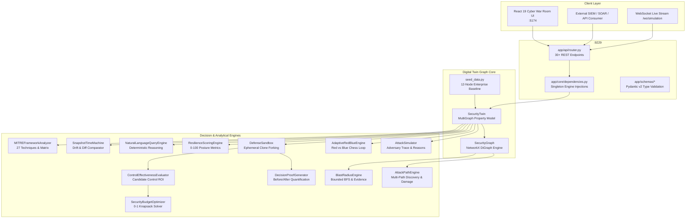

# XTO — Cyber Decision Digital Twin & Adversarial Simulation Lab
### MUJ HACKX 4.0 // CyberSecurity & Defence System // Problem Statement #13
> **"Simulate the attack. Change the defense. Prove what stopped it."**

[](https://www.python.org/)
[](https://fastapi.tiangolo.com/)
[](https://react.dev/)
[](https://vitejs.dev/)
[](https://www.docker.com/)
[](https://networkx.org/)
[](https://docs.pydantic.dev/)
[](LICENSE)

---

## Table of Contents
1. [Executive Summary & Problem Statement](#1-executive-summary--problem-statement)
2. [Exhaustive Glossary of Terms](#2-exhaustive-glossary-of-terms)
   - [2.1 Digital Twin & Entity Modeling Terms](#21-digital-twin--entity-modeling-terms)
   - [2.2 Graph Theory & Attack Path Analytics Terms](#22-graph-theory--attack-path-analytics-terms)
   - [2.3 Adversary Simulation, Personas & Threat Terms](#23-adversary-simulation-personas--threat-terms)
   - [2.4 Defensive Engineering, Controls & Countermeasures](#24-defensive-engineering-controls--countermeasures)
   - [2.5 Decision Intelligence, Sandboxing & Proof Verification Terms](#25-decision-intelligence-sandboxing--proof-verification-terms)
   - [2.6 Mathematical & Algorithmic Optimization Terms](#26-mathematical--algorithmic-optimization-terms)
   - [2.7 MITRE ATT&CK Framework Terms](#27-mitre-attck-framework-terms)
   - [2.8 Epistemic Evidence & Audit Ledger Terms](#28-epistemic-evidence--audit-ledger-terms)
3. [System Architecture & Core Working Mechanisms](#3-system-architecture--core-working-mechanisms)
   - [3.1 High-Level Architectural Dataflow](#31-high-level-architectural-dataflow)
   - [3.2 Digital Twin Ingestion & MultiGraph Projection](#32-digital-twin-ingestion--multigraph-projection)
   - [3.3 Directed Pathfinding, Chokepoint & Damage Scoring](#33-directed-pathfinding-chokepoint--damage-scoring)
   - [3.4 Agent-Based Adversary Simulation State Machine](#34-agent-based-adversary-simulation-state-machine)
   - [3.5 Adaptive Red vs Blue Cyber Chess Loop](#35-adaptive-red-vs-blue-cyber-chess-loop)
   - [3.6 Ephemeral Virtual Sandboxing & Decision Proof Generation](#36-ephemeral-virtual-sandboxing--decision-proof-generation)
   - [3.7 0–1 Knapsack Dynamic Programming Budget Optimizer](#37-01-knapsack-dynamic-programming-budget-optimizer)
   - [3.8 Enterprise Resilience 5-Factor Scoring Model](#38-enterprise-resilience-5-factor-scoring-model)
   - [3.9 Snapshot Time Machine & Graph Drift Diffing](#39-snapshot-time-machine--graph-drift-diffing)
   - [3.10 Deterministic Natural Language Graph Query Pipeline](#310-deterministic-natural-language-graph-query-pipeline)
4. [Flagship Capabilities & Simulation Lab (Features 1–11)](#4-flagship-capabilities--simulation-lab-features-111)
5. [MITRE ATT&CK Enterprise Matrix Engine](#5-mitre-attck-enterprise-matrix-engine)
6. [Complete REST & WebSocket API Reference](#6-complete-rest--websocket-api-reference)
7. [Codebase Blueprint & Directory Walkthrough](#7-codebase-blueprint--directory-walkthrough)
8. [Installation & Deployment Guide](#8-installation--deployment-guide)
9. [Automated Verification & Test Suite Execution](#9-automated-verification--test-suite-execution)
10. [24-Step Hackathon Live Demonstration Script](#10-24-step-hackathon-live-demonstration-script)
11. [Authors & Project Governance](#11-authors--project-governance)

---

## 1. Executive Summary & Problem Statement

Modern enterprise security suffers from a critical structural flaw: **defenders think in lists, but attackers think in graphs**. 

Security Operations Centers (SOCs) and vulnerability management teams are inundated with thousands of isolated CVE alerts, compliance checkboxes, and endpoint notifications. However, an adversary does not exploit vulnerabilities in isolation. Instead, they string together seemingly benign misconfigurations, unsegmented network routes, cached domain credentials, and perimeter services into **contiguous lateral attack paths** that inevitably reach mission-critical Crown Jewels.

### The XTO Solution: Problem Statement #13
**XTO** transforms defensive cybersecurity from reactive guesswork into an **exact, mathematically verifiable science**. 

By constructing an in-memory **Cyber Decision Digital Twin** of the enterprise infrastructure, XTO enables defensive teams to:
1. **Map Viable Lateral Attack Paths**: Discover how external adversaries pivot through perimeter vulnerabilities, intermediate workstations, and Active Directory domain controllers to compromise critical crown jewels.
2. **Execute Agent-Based Adversarial Simulations**: Simulate realistic cyber adversaries (APT groups, Ransomware syndicates, Malicious Insiders) step-by-step with causal prerequisites and MITRE ATT&CK techniques.
3. **Play Adaptive Red vs Blue Cyber Chess**: Simulate multi-round engagements where Blue automatically deploys chokepoint countermeasures and Red dynamically recalculates detour attack routes.
4. **Generate Quantitative Decision Proofs**: Use ephemeral in-memory sandboxes to mathematically prove how many attack paths are eliminated and how much blast radius drops—*before spending a dollar or modifying production infrastructure*.
5. **Optimize Security Budgets**: Leverage algorithmic 0–1 Knapsack optimization to extract maximum risk reduction under strict financial limits.
6. **Query Infrastructure in Natural Language**: Get 100% deterministic, non-hallucinated security answers directly calculated by the underlying graph theory engines.

---

## 2. Exhaustive Glossary of Terms

To ensure rigorous understanding across cybersecurity, graph analytics, and decision intelligence, every technical term used within XTO is defined below in exhaustive detail:

### 2.1 Digital Twin & Entity Modeling Terms

- **Digital Twin (Security Digital Twin)**: An in-memory, high-fidelity, queryable mathematical graph representation of an enterprise IT/OT/Cloud environment. It captures assets, identity principals, access permissions, protocols, open ports, cached credentials, and active security controls without touching or perturbing live production infrastructure.
- **Asset**: A physical, virtual, or cloud compute node within the enterprise (e.g., employee laptop `WS-ENG-04`, domain controller `DC-CORP-01`, production database `DB-PROD-01`). Every asset maintains rich metadata including IP address, operating system, zone, criticality tier, and installed vulnerabilities.
- **Asset Criticality**: The business value tier of a compute asset:
  - `TIER_0_CROWN_JEWEL`: Mission-critical infrastructure whose compromise threatens organizational survival (e.g., Active Directory Root, Ransomware Backup Vault, Financial Database).
  - `TIER_1_CRITICAL`: Core production systems, CI/CD runners, and key API gateways.
  - `TIER_2_INTERNAL`: Corporate employee workstations, intranet portals, and staging environments.
  - `TIER_3_PERIMETER`: DMZ bastion hosts, public web servers, and external VPN gateways.
- **Identity (Principal)**: A user account, service account, or machine credential (e.g., `ID-DOMAIN-ADMIN`, `ID-ENG-DEV`, `ID-SVC-APP`). Identities carry credential states (`ACTIVE`, `COMPROMISED`, `REVOKED`) and privilege levels.
- **Privilege Level**: The authorization tier granted to an identity:
  - `STANDARD`: Basic user access with non-administrative rights.
  - `ELEVATED`: Privileged developer, operator, or service account.
  - `LOCAL_ADMIN`: Full administrative control over a single local host.
  - `DOMAIN_ADMIN`: Tier-0 Active Directory administrator with domain-wide impersonation capabilities.
  - `SYSTEM`: Kernel-level or root OS execution privileges.
- **Security Zone**: A logical or physical network perimeter grouping assets by security trust boundary (`PERIMETER`, `DMZ`, `INTERNAL_CORPORATE`, `PRODUCTION_CLOUD`, `AIR_GAPPED_VAULT`).
- **Crown Jewels**: The organization’s most critical, non-negotiable data assets whose compromise leads to catastrophic operational failure, regulatory penalties, or existential loss (e.g., `VAULT-BACKUP-01` Immutable Ransomware Backup, `DB-PROD-01` Financial Ledger).
- **Directional Relationship (Edge)**: A directed dependency, connection, or permission connecting two nodes in the digital twin:
  - `CONNECTS_TO`: Network reachability over specific ports/protocols (e.g., TCP 445 SMB, TCP 3389 RDP).
  - `AUTHENTICATES_TO`: Ability of an identity to authenticate against an asset.
  - `HAS_CREDENTIAL_FOR`: Storage or caching of an identity's credential in the memory (LSASS) or disk of an asset.
  - `EXECUTES_ON`: Execution authorization on a compute target.
  - `CONTAINS`: Logical containment (e.g., a subnet containing a server).
- **Vulnerability (CVE)**: A documented Common Vulnerabilities and Exposures defect with CVSS severity, affected software, and exploitable MITRE ATT&CK techniques (e.g., `CVE-2021-44228` Log4Shell RCE, `CVE-2020-1472` ZeroLogon).

---

### 2.2 Graph Theory & Attack Path Analytics Terms

- **Security Graph**: The directed property multigraph $G = (V, E)$ constructed from the Digital Twin where vertices $V$ represent compute assets and identities, and edges $E$ represent directional lateral transitions.
- **Attack Path**: A directed, contiguous sequence of assets and identity pivots ($v_0 \xrightarrow{e_1} v_1 \xrightarrow{e_2} \dots \xrightarrow{e_k} v_k$) that an adversary can traverse from an initial entry point to reach a target crown jewel.
- **Hop Count**: The number of network transitions or lateral pivots required to travel from the initial entry node to the target crown jewel.
- **Attacker Effort Score**: A normalized numerical difficulty metric (1.0–10.0) assigned to each edge and summed across a path, reflecting exploit complexity, privilege prerequisites, and stealth required:
  - Direct network transition without credentials: `1.0`
  - Pivot using active valid credentials: `2.0`
  - Exploiting unpatched vulnerability / LSASS dumping: `3.0`
  - Bypassing hardened controls / Multi-Factor: `5.0+`
- **Graph Chokepoint**: A critical bottleneck asset or network bridge that intersects a disproportionately high percentage of all viable attack paths (e.g., if 11 out of 11 attack paths pass through `DC-CORP-01`, isolating or hardening `DC-CORP-01` severs 100% of routes).
- **Elimination Ratio**: The percentage of all viable attack paths severed if a specific node or edge is remediated:
  $$\text{Elimination Ratio} = \frac{\text{Paths Passing Through Node}}{\text{Total Viable Paths}} \times 100\%$$
- **Blast Radius**: The potential lateral fallout and cascading reachability if an asset is compromised:
  - **1-Hop Direct Reachability**: Assets immediately connected via direct network routes or stored credentials.
  - **$k$-Hop Indirect Transitive Impact**: All assets reachable via transitive multi-hop paths bounded by BFS traversal depth `max_depth`.
  - **Blast Radius Percentage**: $\frac{\text{Total Reachable Assets}}{\text{Total Enterprise Assets}} \times 100\%$.
- **Damage Assessment**: A normalized 0–100 severity metric calculated along an attack path evaluating cumulative asset criticality, breached security zones, collateral reachable nodes, and exposed Active Directory credentials. Severity tiers:
  - `LOW`: Score $< 40.0$
  - `MEDIUM`: Score $40.0 - 59.9$
  - `HIGH`: Score $60.0 - 79.9$
  - `CATASTROPHIC`: Score $\ge 80.0$ (automatically assigned if a Crown Jewel is breached).

---

### 2.3 Adversary Simulation, Personas & Threat Terms

- **Threat Vector**: An initial adversarial attack method, delivery vehicle, and prerequisite checklist used to establish an initial enterprise foothold (e.g., `THREAT-PHISH` Spearphishing with malicious attachment, `THREAT-VPN` Exploitation of unpatched SSL-VPN gateway).
- **Adversary Persona**: Archetypal attacker profile dictating behavioral characteristics, technical capabilities, stealth tolerance, and MITRE technique preferences:
  - `APT` (Advanced Persistent Threat): Low noise, maximum patience, avoids triggering EDR, exploits zero-days, prioritizes persistence and espionage.
  - `RANSOMWARE`: Rapid automated credential dumping (LSASS), fast SMB lateral spread, seeks immediate backup encryption and volume shadow deletion.
  - `INSIDER`: Bypasses perimeter controls via existing legitimate user privileges, seeks sensitive data exfiltration.
  - `SCRIPT_KIDDIE`: Noisy, automated exploit scanning, low stealth, easily detected by basic intrusion detection systems.
- **Simulation Event / Step**: A discrete atomic transition taken by an adversary agent during a simulation run, capturing the phase, source asset, target asset, protocol, MITRE technique ID, and success status.
- **Causal Evidence Reasons**: Machine-verifiable explanations generated for every simulation transition detailing the exact causal chain that allowed the move (e.g., *"Open port TCP 445 confirmed"*, *"Cached Domain Admin NTLM hash dumped from LSASS"*, *"No egress micro-segmentation rule present"*).
- **Adaptive Red vs Blue Simulation**: A multi-round adversarial simulation game:
  - **Red Team**: Automated adversary agent dynamically probing shortest paths to crown jewels.
  - **Blue Team**: Automated defender detecting compromised chokepoints and deploying real-time countermeasures.
  - **Adaptive Rerouting**: When Blue severs Red's current path, Red dynamically recalculates alternate routes across adjacent subnets.

---

### 2.4 Defensive Engineering, Controls & Countermeasures

- **Security Control**: A defensive countermeasure deployed to mitigate vulnerabilities, sever edges, or block adversary techniques:
  - `MFA` (Multi-Factor Authentication): Enforces cryptographic authentication, neutralizing stolen credential pivots.
  - `NETWORK_SEGMENTATION` (Air-Gap / Micro-Segmentation): Drops unauthorized traffic between subnets, isolating crown jewels.
  - `EDR` (Endpoint Detection & Response): Blocks credential dumping (LSASS access) and PowerShell execution.
  - `LEAST_PRIVILEGE`: Revokes excessive administrative permissions and purges cached privileged tokens from memory.
  - `HOST_ISOLATION`: Sever all inbound and outbound network relationships to quarantine a compromised host.
  - `VULN_PATCHING`: Eliminates known CVE defects, removing exploitation prerequisites.
- **Control Status**: Operational state of a security countermeasure:
  - `ENFORCING`: Active and actively blocking unauthorized actions.
  - `AUDITING`: Logging events without dropping or blocking traffic.
  - `DISABLED`: Inactive and ignored by the simulation engine.
- **Virtual Control (`is_virtual: true`)**: A candidate defensive control injected into an ephemeral sandbox during "What-If?" analysis. Virtual controls exist only in memory and never alter the baseline production twin.

---

### 2.5 Decision Intelligence, Sandboxing & Proof Verification Terms

- **Ephemeral Virtual Sandbox**: An isolated, in-memory clone of the Digital Twin created via `twin.fork_virtual_sandbox()`. It allows defenders to test candidate controls or patch vulnerabilities without altering the production baseline.
- **Counterfactual "What If?" Simulation**: A simulation exploring alternate realities (*"What if we deployed FIDO2 MFA on Domain Admins and air-gapped the backup server?"*). By comparing before-and-after runs, it quantifies paths eliminated, blast radius reduction, and residual risk.
- **Decision Proof (Core USP)**: A quantitative, causal certificate proving defense effectiveness:
  - **Verdict**:
    - `PROVEN_DEFENSE_SUCCESS`: All critical attack paths to crown jewels are completely severed.
    - `PARTIAL_MITIGATION`: Significant attack paths eliminated, but residual detour routes remain.
    - `DEFENSE_FAILED`: The proposed intervention failed to block adversary reachability.
  - **Quantified Metrics**: Exact count of critical paths eliminated, crown jewels protected, and blast radius delta.
- **Security Control ROI Score**: The mathematical risk reduction achieved per dollar invested:
  $$\text{ROI Score} = \frac{\text{Risk Reduction \%} \times 1000}{\max(1, \text{Cost USD})}$$
- **Topological Drift**: Structural changes occurring in the graph between two points in time (e.g., newly opened attack paths, severed routes, changed controls, and privilege modifications).
- **Single Point of Failure (SPOF)**: An asset whose compromise immediately exposes crown jewels without requiring further complex lateral pivots.

---

### 2.6 Mathematical & Algorithmic Optimization Terms

- **0–1 Knapsack Optimization**: A dynamic programming algorithm that finds the optimal subset of defensive controls maximizing risk reduction without exceeding a specified financial budget:
  $$\max \sum_{i=1}^n x_i \cdot \text{RiskReduction}_i \quad \text{subject to} \quad \sum_{i=1}^n x_i \cdot \text{Cost}_i \le \text{AvailableBudget}, \quad x_i \in \{0, 1\}$$
- **Bounded Breadth-First Search (BFS)**: An iterative queue-based graph traversal exploring all reachable nodes up to a maximum distance `max_depth`.
- **Depth-First Search (DFS) Simple Paths**: A path-enumeration traversal finding all non-cyclic directed sequences connecting source $s$ and target $t$ subject to a maximum hop cutoff.
- **Enterprise Resilience Score**: A normalized 0–100 metric evaluating an enterprise's defense-in-depth posture across 5 weighted dimensions:
  1. *Path Redundancy (25%)*: Scarcity of alternative routes to crown jewels.
  2. *Chokepoint Mitigation (25%)*: Coverage of critical graph bridge nodes.
  3. *Control Density (20%)*: Ratio of active controls to total assets.
  4. *Defense in Depth (15%)*: Average hop distance to sensitive systems.
  5. *Privilege Tiering (15%)*: Restriction and isolation of administrative credentials.

---

### 2.7 MITRE ATT&CK Framework Terms

- **Tactics**: The adversarial "Why" — tactical objectives behind an attacker's actions across 11 enterprise phases:
  - `TA0001: Initial Access`, `TA0002: Execution`, `TA0003: Persistence`, `TA0004: Privilege Escalation`, `TA0005: Defense Evasion`, `TA0006: Credential Access`, `TA0007: Discovery`, `TA0008: Lateral Movement`, `TA0009: Collection`, `TA0011: Command and Control`, `TA0040: Impact`.
- **Techniques**: The adversarial "How" — specific technical actions taken to achieve a tactic (e.g., `T1003.001 LSASS Memory Dumping`, `T1021.002 SMB Admin Shares`, `T1486 Data Encrypted for Impact`).
- **Mitigation Coverage**: The ratio of techniques with active defensive controls to total exploitable techniques in the enterprise:
  $$\text{Coverage \%} = \frac{\text{Mitigated Techniques}}{\text{Total Catalog Techniques}} \times 100\%$$
- **Blind Spot**: A high-severity MITRE technique exploitable within the current digital twin topology for which no active defensive control exists.

---

### 2.8 Epistemic Evidence & Audit Ledger Terms

- **Epistemic Certainty**: Classification of security evidence according to verification ground truth:
  - `FACT`: Ground truth derived directly from topology, open ports, and validated credentials.
  - `DERIVED`: Deduced through deterministic graph pathfinding and reachability rules.
  - `HYPOTHESIS`: Predictive outcome modeled during counterfactual or adversary simulation.
- **Evidence Ledger**: An append-only historical audit trail capturing every state change, simulated breach, and mitigation proof for compliance and forensic review.

---

## 3. System Architecture & Core Working Mechanisms

### 3.1 High-Level Architectural Dataflow



---

### 3.2 Digital Twin Ingestion & MultiGraph Projection

1. **State Ingestion**: On startup, [`SecurityTwin`](file:///c:/Users/adity/Downloads/xto-main/backend/xto_core/twin/security_twin.py) initializes from [`seed_data.py`](file:///c:/Users/adity/Downloads/xto-main/backend/xto_core/twin/seed_data.py) loading:
   - **12 Compute Assets**: Spanning Perimeter (`DMZ-GW-01`, `VPN-EXT-01`), Corporate LAN (`WS-ENG-04`, `WS-FIN-02`, `DC-CORP-01`), Cloud Production (`APP-PROD-01`, `DB-PROD-01`), and High-Security Vaults (`VAULT-BACKUP-01`).
   - **6 Identity Principals**: Including `ID-DOMAIN-ADMIN`, `ID-ENG-DEV`, and `ID-SVC-APP`.
   - **14 Directional Edges**: Representing authenticated protocols (`TCP 445 SMB`, `TCP 3389 RDP`, `TCP 22 SSH`, `TCP 1433 MSSQL`).
   - **Baseline Controls**: Active firewalls, EDR agents, and segmentation boundaries.
2. **Hash-Indexed Lookups**: Assets, identities, controls, and relationships are stored in dictionaries (`_assets_map`, `_identities_map`, `_controls_map`, `_relationships_map`) enabling $O(1)$ lookups during simulation ticks.
3. **Graph Projection**: [`SecurityGraph`](file:///c:/Users/adity/Downloads/xto-main/backend/xto_core/graph/security_graph.py) converts the topology into a `networkx.DiGraph`. Edges receive weights representing attacker effort:
   - `CREDENTIAL_ACCESS` (LSASS dumping): Weight = 3.0
   - `REMOTE_EXECUTION` (SMB / WinRM pivot): Weight = 2.0
   - `NETWORK_REACHABILITY` (TCP route): Weight = 1.0

---

### 3.3 Directed Pathfinding, Chokepoint & Damage Scoring

1. **Pathfinding**: [`AttackPathEngine.find_all_attack_paths()`](file:///c:/Users/adity/Downloads/xto-main/backend/xto_core/graph/path_engine.py) computes all simple directed paths between entry point and target using DFS bounded by `cutoff` (default 7–8 hops).
2. **Edge Evidence Building**: For every hop, an [`AttackPathEdgeEvidence`](file:///c:/Users/adity/Downloads/xto-main/backend/app/schemas/lab.py) object is created documenting:
   - Protocol & Network Reachability (`network: "reachable"`)
   - Target Port & Service (`service: "Microsoft-DS (SMB)", port: 445`)
   - Identity & Credential in play (`identity: "Domain Admin"`)
   - Current privilege escalation status (`privilege: "DOMAIN_ADMIN"`)
   - Active blocking controls (if any)
   - MITRE Technique ID & Name (`T1021.002 SMB Admin Shares`)
   - Step-by-step causal reasons list (`reasons: List[str]`)
3. **Damage Assessment Calculation**:
   $$\text{Damage Score} = \min\left(100.0, \frac{\sum \text{Hop Criticality} \times \text{Privilege Multiplier}}{\text{Hop Count} \times 10.0} \times 100.0\right)$$
   If any crown jewel is compromised, the score floor is elevated to 85.0 (`CATASTROPHIC`).
4. **Chokepoint Identification**: Computes vertex betweenness and path intersection ratio:
   $$\text{Elimination Ratio} = \frac{\text{Paths Passing Through Node}}{\text{Total Viable Paths}} \times 100\%$$

---

### 3.4 Agent-Based Adversary Simulation State Machine

1. An [`AttackerAgentProfile`](file:///c:/Users/adity/Downloads/xto-main/backend/app/schemas/simulation.py) is instantiated with specific capabilities (`DUMP_LSASS`, `PASS_THE_HASH`, `PIVOT_SMB`, etc.).
2. The agent begins at `initial_foothold_id`. At each tick:
   - Evaluates adjacent successors in the graph.
   - Evaluates prerequisite compliance (does the attacker hold local administrator credentials to dump LSASS?).
   - Checks if any active [`SecurityControl`](file:///c:/Users/adity/Downloads/xto-main/backend/app/schemas/twin.py) blocks the move:
     - `MFA`: Blocks stolen credential replay on administrative sessions.
     - `NETWORK_SEGMENTATION`: Drops unauthorized SMB/WinRM packets across subnet boundaries.
     - `HOST_ISOLATION`: Completely severs all edge transitions to/from quarantined nodes.
   - If unblocked, updates `state.compromised_assets` and advances.
3. Produces a complete [`SimulationTrace`](file:///c:/Users/adity/Downloads/xto-main/backend/app/schemas/simulation.py) with timeline events, elapsed timestamps, compromised assets, and blast radius.

---

### 3.5 Adaptive Red vs Blue Cyber Chess Loop

[`AdaptiveRedBlueEngine`](file:///c:/Users/adity/Downloads/xto-main/backend/xto_core/simulation/red_blue_engine.py) orchestrates multi-round adversarial battles:

```mermaid
sequenceDiagram
    participant Red as Red Team Agent
    participant Graph as Digital Twin Graph
    participant Blue as Blue Team Defender
    
    Note over Red,Blue: Round 1
    Red->>Graph: Probe shortest path to Crown Jewel
    Graph-->>Red: Path: WS-ENG-04 -> DC-CORP-01 -> VAULT-BACKUP-01
    Red->>Graph: Execute Hop 1 (Dump LSASS) & Hop 2 (Pivot to DC)
    Blue->>Graph: Detect compromised chokepoint (DC-CORP-01)
    Blue->>Graph: Deploy Countermeasure: Network Segmentation on DC-CORP-01
    
    Note over Red,Blue: Round 2 (Adaptive Rerouting)
    Red->>Graph: Probe route to Crown Jewel
    Graph-->>Red: Direct route severed! Detour found via APP-PROD-01
    Red->>Graph: Reroute: WS-ENG-04 -> APP-PROD-01 -> DB-PROD-01
    Blue->>Graph: Detect perimeter pivot; Deploy Host Isolation on APP-PROD-01
    
    Note over Red,Blue: Round 3 (Containment)
    Red->>Graph: Probe remaining routes
    Graph-->>Red: 0 viable paths remain!
    Note over Red,Blue: OUTCOME: BLUE_VICTORY (All Paths Severed)
```

---

### 3.6 Ephemeral Virtual Sandboxing & Decision Proof Generation

1. The defender specifies a set of hypothetical interventions via `POST /api/what-if` or `POST /api/simulations/what-if`.
2. [`DefenseSandbox.fork_virtual_sandbox()`](file:///c:/Users/adity/Downloads/xto-main/backend/xto_core/what_if/sandbox.py) deep-copies the entire Digital Twin topology into a lightweight ephemeral twin.
3. Virtual controls (`is_virtual: true`) are activated inside the sandbox.
4. Parallel simulation runs on both Baseline and Sandbox:
   - $\Delta \text{ Paths} = \text{Paths}_{\text{Baseline}} - \text{Paths}_{\text{Sandbox}}$
   - $\Delta \text{ Blast Radius} = \text{Blast \%}_{\text{Baseline}} - \text{Blast \%}_{\text{Sandbox}}$
   - $\text{Risk Reduction \%} = \frac{\Delta \text{ Paths}}{\text{Paths}_{\text{Baseline}}} \times 100\%$
5. [`DecisionProofGenerator`](file:///c:/Users/adity/Downloads/xto-main/backend/xto_core/what_if/proof_generator.py) produces a signed [`DecisionProof`](file:///c:/Users/adity/Downloads/xto-main/backend/app/schemas/defense.py) with mathematical verdict.

---

### 3.7 0–1 Knapsack Dynamic Programming Budget Optimizer

Given a set of candidate defensive controls $C = \{c_1, c_2, \dots, c_n\}$, each having an implementation cost $w_i = \text{Cost}(c_i)$ and a quantified risk reduction value $v_i = \text{RiskReduction}(c_i)$, [`SecurityBudgetOptimizer`](file:///c:/Users/adity/Downloads/xto-main/backend/xto_core/prioritization/budget_optimizer.py) solves:

$$dp[i][w] = \max(dp[i-1][w], \, dp[i-1][w - w_i] + v_i) \quad \text{for } w \ge w_i$$

- **Time Complexity**: $O(n \cdot W)$ where $n$ is the number of candidate controls and $W$ is the integer budget.
- **Output**: Returns the exact set of controls to deploy, total cost spent, budget remaining, and total risk reduction percentage achieved.

---

### 3.8 Enterprise Resilience 5-Factor Scoring Model

[`ResilienceScoringEngine`](file:///c:/Users/adity/Downloads/xto-main/backend/xto_core/resilience/resilience_engine.py) computes a normalized 0–100 resilience score:

$$\text{Resilience Score} = 0.25 \cdot S_{\text{path}} + 0.25 \cdot S_{\text{choke}} + 0.20 \cdot S_{\text{control}} + 0.15 \cdot S_{\text{depth}} + 0.15 \cdot S_{\text{priv}}$$

1. **Path Scarcity Factor ($S_{\text{path}}$)**: Inversely proportional to the number of viable attack paths reaching Crown Jewels: $S_{\text{path}} = \max(0, 100 - (\text{viable\_paths} \times 8))$.
2. **Chokepoint Mitigation Factor ($S_{\text{choke}}$)**: Percentage of detected graph chokepoints equipped with active, enforcing controls.
3. **Control Density Factor ($S_{\text{control}}$)**: Ratio of protected assets to total assets in the digital twin: $\frac{|A_{\text{protected}}|}{|A_{\text{total}}|} \times 100\%$.
4. **Defense in Depth Factor ($S_{\text{depth}}$)**: Average shortest path hop length from perimeter to crown jewels. Longer paths grant higher detection time.
5. **Privilege Tiering Factor ($S_{\text{priv}}$)**: Evaluates whether administrative credentials (Tier-0) are isolated from general user workstations.

---

### 3.9 Snapshot Time Machine & Graph Drift Diffing

1. `POST /api/snapshots` serializes the current Digital Twin graph, controls, and paths into an immutable [`SnapshotSummary`](file:///c:/Users/adity/Downloads/xto-main/backend/app/schemas/lab.py).
2. When two snapshots are compared via `POST /api/snapshots/compare`, [`SnapshotTimeMachine`](file:///c:/Users/adity/Downloads/xto-main/backend/xto_core/synchronization/snapshot_comparator.py) computes graph delta:
   - **Paths Opened**: New attack paths made viable by configuration changes.
   - **Paths Severed**: Previously viable attack paths neutralized by controls.
   - **Assets & Controls Added/Removed**: Entity topology drift.
   - **Privilege Changes**: Escalations or credential revocations.

---

### 3.10 Deterministic Natural Language Graph Query Pipeline

[`NaturalLanguageQueryEngine`](file:///c:/Users/adity/Downloads/xto-main/backend/xto_core/reasoning/nl_query_engine.py) parses plain-text questions into structured graph-intent queries:

```
User Query: "Can an attacker reach backup vault from engineering workstation?"
      │
      ▼
Intent Parser: REACHABILITY_CHECK
  - Source: WS-ENG-04
  - Target: VAULT-BACKUP-01
      │
      ▼
Graph Traversal Engine (NetworkX):
  - Computes all simple paths between WS-ENG-04 and VAULT-BACKUP-01
  - Evaluates active controls along edges
      │
      ▼
Deterministic Result (Zero Hallucination):
  - Status: "REACHABLE"
  - Path Count: 11 viable paths
  - Shortest Hop Count: 2 hops (WS-ENG-04 -> DC-CORP-01 -> VAULT-BACKUP-01)
  - Critical Chokepoint: DC-CORP-01 (intersects 100% of paths)
```

---

## 4. Flagship Capabilities & Simulation Lab (Features 1–11)

| # | Feature Name | Description | Key File | Primary API Endpoint |
|---|---|---|---|---|
| **1** | **Causal Evidence Reasons** | Step-by-step causal explanations on every simulation event detailing why an exploit succeeded | `simulation/simulator.py` | `POST /api/simulations` |
| **2** | **Adaptive Red vs Blue Engine** | Multi-round cyber chess simulation with automated Blue chokepoints and dynamic Red rerouting | `simulation/red_blue_engine.py` | `POST /api/simulations/red-blue` |
| **3** | **Counterfactual "What-If?" Sandbox** | Ephemeral in-memory twin forking to test candidate controls with zero production side effects | `what_if/sandbox.py` | `POST /api/simulations/what-if` |
| **4** | **Security Control ROI Evaluator** | Calculates exact risk reduction percentage and ROI score per dollar spent for candidate controls | `prioritization/control_evaluator.py` | `POST /api/control-analysis` |
| **5** | **0–1 Knapsack Budget Optimizer** | Dynamic programming algorithm finding the optimal control portfolio under strict budget limits | `prioritization/budget_optimizer.py` | `POST /api/security-optimization` |
| **6** | **Depth-Configurable Blast Radius** | Bounded BFS traversal (`max_depth = 1..5`) showing direct vs transitive fallout and credential exposure | `blast_radius/blast_engine.py` | `POST /api/blast-radius` |
| **7** | **Attack Path Evidence Graph & Damage** | Per-edge evidence breakdown (ports, protocols, credentials) and normalized 0–100 damage score | `graph/path_engine.py` | `POST /api/attack-paths/analyze` |
| **8** | **Digital Twin Time Machine** | Timestamped snapshot checkpoints with automated graph drift diffing and path comparison | `synchronization/snapshot_comparator.py` | `POST /api/snapshots/compare` |
| **9** | **Enterprise Resilience Score** | 0–100 normalized defense-in-depth posture score across 5 weighted dimensions with SPOF alerts | `resilience/resilience_engine.py` | `GET /api/resilience` |
| **10** | **Deterministic NL Query Engine** | Translates natural language questions into deterministic graph traversals with zero hallucination | `reasoning/nl_query_engine.py` | `POST /api/queries/natural-language` |
| **11** | **Simulation History Registry** | Centralized audit registry of all past simulation runs with granular path & evidence drill-down | `app/api/router.py` | `GET /api/simulations` |

---

## 5. MITRE ATT&CK Enterprise Matrix Engine

XTO includes a dedicated MITRE ATT&CK framework analyzer ([`framework_analyzer.py`](file:///c:/Users/adity/Downloads/xto-main/backend/xto_core/mitre/framework_analyzer.py)) backed by a comprehensive catalog ([`mitre_catalog.py`](file:///c:/Users/adity/Downloads/xto-main/backend/xto_core/mitre/mitre_catalog.py)) of **27 Enterprise Techniques** across **11 Tactics**:

```
┌─────────────────────────────────────────────────────────────────────────────────────────────────────────┐
│                                   ENTERPRISE ATT&CK MATRIX COVERAGE                                     │
├──────────────┬──────────────┬──────────────┬──────────────┬──────────────┬──────────────┬──────────────┤
│ Initial      │ Execution    │ Privilege    │ Defense      │ Credential   │ Lateral      │ Impact       │
│ Access       │              │ Escalation   │ Evasion      │ Access       │ Movement     │              │
├──────────────┼──────────────┼──────────────┼──────────────┼──────────────┼──────────────┼──────────────┤
│ T1190        │ T1059.001    │ T1068        │ T1562.001    │ T1003.001    │ T1021.002    │ T1486        │
│ Exploit Face │ PowerShell   │ Exploit Priv │ Disable Tool │ LSASS Dump   │ SMB Shares   │ Data Encrypt │
│ [MITIGATED]  │ [UNMITIGATED]│ [UNMITIGATED]│ [UNMITIGATED]│ [UNMITIGATED]│ [MITIGATED]  │ [UNMITIGATED]│
├──────────────┼──────────────┼──────────────┼──────────────┼──────────────┼──────────────┼──────────────┤
│ T1566.001    │ T1059.003    │ T1548.002    │ T1070        │ T1110        │ T1021.001    │ T1490        │
│ Spearphish   │ Windows Cmd  │ Bypass UAC   │ Clear Logs   │ Brute Force  │ RDP Pivot    │ Inhibit Recov│
│ [UNMITIGATED]│ [UNMITIGATED]│ [UNMITIGATED]│ [UNMITIGATED]│ [UNMITIGATED]│ [MITIGATED]  │ [UNMITIGATED]│
└──────────────┴──────────────┴──────────────┴──────────────┴──────────────┴──────────────┴──────────────┘
```

- **Live Matrix View (`/mitre`)**: Interactive heatmap showing mitigation status for every technique (`MITIGATED`, `PARTIALLY_MITIGATED`, `UNMITIGATED`).
- **Asset MITRE Profiles**: Query `GET /api/mitre/asset/{asset_id}` to retrieve an asset's technique exposure and applicable defenses.

---

## 6. Complete REST & WebSocket API Reference

All REST endpoints are prefixed with `/api` and documented interactively at `http://localhost:9229/docs`.

### Digital Twin & Infrastructure Management
| Method | Endpoint | Request Body | Description |
|---|---|---|---|
| `GET` | `/api/health` | _None_ | System status, assets loaded, active controls count |
| `GET` | `/api/twin` | _None_ | Full Digital Twin topology (assets, identities, edges, controls) |
| `POST` | `/api/twin/assets` | `Asset` JSON | Add an asset to the Digital Twin |
| `POST` | `/api/twin/relationships` | `Relationship` JSON | Add a directional relationship edge |
| `POST` | `/api/twin/identities` | `Identity` JSON | Add an identity / credential principal |
| `POST` | `/api/twin/controls` | `SecurityControl` JSON | Add or update a security control |
| `GET` | `/api/twin/changes` | _None_ | Audit log of all environment modifications |
| `POST` | `/api/twin/sync` | `SyncRequest` JSON | Trigger synthetic or JSON environment synchronization |

### Attack Paths & Blast Radius
| Method | Endpoint | Request Body | Description |
|---|---|---|---|
| `POST` | `/api/attack-paths/analyze` | `{"source_asset_id": str, "target_asset_id": str, "sort_by": "effort"\|"hops"}` | Multi-path discovery with per-edge evidence & damage score |
| `GET` | `/api/attack-paths` | `?source_id=...&target_id=...` | Query default attack paths between two assets |
| `POST` | `/api/blast-radius` | `{"asset_id": str, "max_depth": int}` | **(Feature #6)** Depth-configurable blast radius & evidence |
| `GET` | `/api/blast-radius/{asset_id}` | _None_ | Legacy 1-hop and transitive blast radius |

### Adversarial Simulation Lab
| Method | Endpoint | Request Body | Description |
|---|---|---|---|
| `GET` | `/api/attackers` | _None_ | Available attacker persona profiles (APT, Ransomware, Insider) |
| `POST` | `/api/simulations` | `SimulationRequest` JSON | **(Feature #1)** Run attack simulation with causal evidence reasons |
| `POST` | `/api/simulations/red-blue` | `RedBlueSimulationRequest` JSON | **(Feature #2)** Run adaptive multi-round Red vs Blue simulation |
| `POST` | `/api/simulations/what-if` | `WhatIfSimulationRequest` JSON | **(Feature #3)** Run counterfactual "What-If?" virtual sandbox test |
| `GET` | `/api/simulations` | _None_ | **(Feature #11)** List simulation history |
| `GET` | `/api/simulations/{id}` | _None_ | Get simulation trace by ID |
| `POST` | `/api/simulations/{id}/run` | _None_ | Re-run a past simulation |
| `GET` | `/api/simulations/{id}/attack-paths` | _None_ | **(Feature #11)** Get attack paths from simulation run |
| `GET` | `/api/simulations/{id}/attack-paths/{path_id}/evidence` | _None_ | **(Feature #7)** Granular per-edge evidence for path |

### Defense Sandbox, Decision Proof & Optimization
| Method | Endpoint | Request Body | Description |
|---|---|---|---|
| `POST` | `/api/what-if` | `WhatIfRequest` JSON | Evaluate defensive interventions and generate Decision Proof |
| `POST` | `/api/what-if/compare` | `WhatIfRequest` JSON | Compare baseline vs virtual defense sandbox |
| `POST` | `/api/control-analysis` | `ControlEffectivenessRequest` JSON | **(Feature #4)** Evaluate candidate control effectiveness & ROI |
| `POST` | `/api/security-optimization` | `SecurityOptimizationRequest` JSON | **(Feature #5)** 0–1 Knapsack security budget optimizer |
| `GET` | `/api/remediation/priorities` | _None_ | Remediation priority ranking based on path elimination |

### Time Machine, Resilience & AI Reasoning
| Method | Endpoint | Request Body | Description |
|---|---|---|---|
| `POST` | `/api/snapshots` | `{"name": str, "description": str}` | **(Feature #8)** Create timestamped Digital Twin checkpoint |
| `GET` | `/api/snapshots` | _None_ | **(Feature #8)** List snapshot summaries |
| `GET` | `/api/snapshots/{id}` | _None_ | **(Feature #8)** Get snapshot topology by ID |
| `POST` | `/api/snapshots/compare` | `{"baseline_snapshot_id": str, "target_snapshot_id": str}` | **(Feature #8)** Compare two snapshots for graph drift & opened paths |
| `GET` | `/api/resilience` | _None_ | **(Feature #9)** 0–100 normalized enterprise resilience score |
| `POST` | `/api/queries/natural-language` | `{"query": str}` | **(Feature #10)** Deterministic natural language security query |
| `POST` | `/api/explain` | `ExplanationRequest` JSON | Explainable AI causal explanations (transitions/defenses) |

### MITRE ATT&CK Framework
| Method | Endpoint | Request Body | Description |
|---|---|---|---|
| `GET` | `/api/mitre/techniques` | _None_ | Full catalog of 27 Enterprise ATT&CK techniques |
| `GET` | `/api/mitre/coverage` | _None_ | Tactic coverage report, posture score, and blind spots |
| `GET` | `/api/mitre/matrix` | _None_ | Full 11-tactic Enterprise ATT&CK matrix with mitigation status |
| `GET` | `/api/mitre/asset/{asset_id}` | _None_ | Asset-specific MITRE exposure profile |

### WebSocket Live Stream
| Protocol | Endpoint | Description |
|---|---|---|
| `WS` | `/ws/simulation/{sim_id}` | Real-time WebSocket event streaming for Cyber War Room playback |

---

## 7. Codebase Blueprint & Directory Walkthrough

```
xto/
├── backend/
│   ├── app/
│   │   ├── api/
│   │   │   └── router.py                 # FastAPI router with 30+ endpoints
│   │   ├── core/
│   │   │   └── dependencies.py           # Dependency injection & engine singletons
│   │   ├── main.py                       # App lifecycle, CORS, WebSockets
│   │   └── schemas/                      # Pydantic v2 validation models
│   │       ├── defense.py                # What-if & Decision Proof models
│   │       ├── evidence.py               # Evidence & Remediation models
│   │       ├── lab.py                    # Advanced Simulation Lab schemas
│   │       ├── mitre.py                  # MITRE ATT&CK models
│   │       ├── simulation.py             # Attacker agent & trace models
│   │       ├── threat.py                 # Threat vector models
│   │       └── twin.py                   # Digital Twin topology models
│   ├── xto_core/                         # Domain Logic & Mathematical Engines
│   │   ├── blast_radius/blast_engine.py  # Blast radius with configurable depth
│   │   ├── evidence/evidence_collector.py# Epistemic evidence recording
│   │   ├── graph/
│   │   │   ├── path_engine.py            # Attack paths, damage & chokepoints
│   │   │   └── security_graph.py         # NetworkX DiGraph wrapper
│   │   ├── mitre/
│   │   │   ├── framework_analyzer.py     # ATT&CK coverage & matrix builder
│   │   │   └── mitre_catalog.py          # 27 Enterprise techniques & mitigations
│   │   ├── prioritization/
│   │   │   ├── budget_optimizer.py       # 0-1 Knapsack budget optimizer
│   │   │   ├── control_evaluator.py      # Control effectiveness & ROI engine
│   │   │   └── remediation_engine.py     # Remediation ranking engine
│   │   ├── reasoning/
│   │   │   ├── nl_query_engine.py        # Deterministic NL query resolver
│   │   │   └── xai_engine.py             # Explainable AI templates
│   │   ├── resilience/
│   │   │   └── resilience_engine.py      # 0-100 resilience scoring engine
│   │   ├── simulation/
│   │   │   ├── attacker_agent.py         # Persona profiles (APT, Ransomware)
│   │   │   ├── red_blue_engine.py        # Adaptive Red vs Blue game engine
│   │   │   └── simulator.py              # Chronological attack simulator
│   │   ├── synchronization/
│   │   │   ├── snapshot_comparator.py    # Snapshot time machine & drift comparator
│   │   │   └── sync_engine.py            # Environment topology synchronizer
│   │   ├── threat_vectors/
│   │   │   └── threat_engine.py          # Threat vectors & risk assessment
│   │   ├── twin/
│   │   │   ├── security_twin.py          # Digital Twin in-memory multigraph
│   │   │   └── seed_data.py              # 12-node enterprise cyber war room topology
│   │   └── what_if/
│   │       ├── proof_generator.py        # Quantitative decision proof generator
│   │       └── sandbox.py                # Ephemeral virtual sandbox forking
│   ├── tests/                            # Automated Pytest / Unittest Suites
│   │   ├── test_api_routes.py            # 13 API route tests
│   │   ├── test_simulation_and_proof.py  # Simulation & proof tests
│   │   ├── test_simulation_lab.py        # 11 Simulation Lab feature tests
│   │   └── test_twin_and_graph.py        # Topology & graph tests
│   ├── Dockerfile                        # Multi-stage Python 3.11-slim container
│   └── requirements.txt                  # Python dependencies
│
├── frontend/
│   ├── public/                           # Static assets & icons
│   ├── src/
│   │   ├── components/                   # Reusable UI components
│   │   │   ├── DecisionProofCard.tsx     # Decision proof visualization card
│   │   │   ├── HeroGlobe.tsx             # 3D interactive cyber globe
│   │   │   ├── Layout.tsx                # Rakshastra layout with AI Copilot
│   │   │   ├── Tactical3DScene.tsx       # Three.js 3D Digital Twin visualizer
│   │   │   └── TimelinePlayer.tsx        # Step-by-step simulation timeline player
│   │   ├── lib/api.ts                    # Strongly typed API client functions
│   │   ├── pages/                        # 12 Dedicated War Room Pages
│   │   │   ├── AttackPathsPage.tsx       # Attack path graph & chokepoints
│   │   │   ├── AttackSimulationPage.tsx  # Live adversary attack simulator
│   │   │   ├── BlastRadiusPage.tsx       # Blast radius impact analyzer
│   │   │   ├── CommandCenterPage.tsx     # Executive SOC overview
│   │   │   ├── DecisionProofPage.tsx     # Formal mathematical decision proof
│   │   │   ├── DefenseSandboxPage.tsx    # Interactive virtual controls sandbox
│   │   │   ├── DigitalTwinPage.tsx       # 3D topology & asset inspector
│   │   │   ├── EnvironmentSyncPage.tsx   # Live sync & topology drift
│   │   │   ├── EvidenceExplorerPage.tsx  # Epistemic evidence ledger
│   │   │   ├── MitreFrameworkPage.tsx    # MITRE ATT&CK 11-tactic matrix heatmap
│   │   │   ├── RemediationPage.tsx       # Ranked remediation priorities & Jira
│   │   │   └── ThreatVectorsPage.tsx     # Threat vector assessment lab
│   │   ├── App.tsx                       # React router configuration
│   │   ├── index.css                     # TailwindCSS design system & glow effects
│   │   └── main.tsx                      # Frontend entrypoint
│   ├── Dockerfile                        # Multi-stage Node 20 build + Nginx Alpine
│   ├── nginx.conf                        # Production reverse proxy config
│   └── package.json                      # React 19, TypeScript, Lucide, Tailwind
│
├── docker-compose.yml                    # Multi-container orchestration stack
├── run_backend.bat                       # Windows launch script for backend
├── run_frontend.bat                      # Windows launch script for frontend
└── README.md                             # Comprehensive platform documentation
```

---

## 8. Installation & Deployment Guide

### Option A: Docker Full-Stack Deployment (Recommended)
Prerequisites: Docker and Docker Compose installed.

```bash
# 1. Clone the repository
git clone https://github.com/adityatomar4877-rgb/xto.git
cd xto

# 2. Build and start both containers in detached mode
docker compose up -d --build

# 3. View container health & logs
docker compose ps
docker compose logs -f

# 4. Access the platforms:
# Frontend War Room: http://localhost:5174
# Backend API Docs:  http://localhost:9229/docs
# Health Check:      http://localhost:9229/api/health
```

### Option B: Native Local Development

#### 1. Backend Setup (Python 3.11+)
```bash
cd backend

# Create and activate virtual environment
python -m venv .venv
# On Windows:
.venv\Scripts\activate
# On Linux / macOS:
source .venv/bin/activate

# Install dependencies
pip install -r requirements.txt

# Start FastAPI server with live reload
python -m uvicorn app.main:app --host 127.0.0.1 --port 9229 --reload
```
- API Server: `http://127.0.0.1:9229`
- Swagger Documentation: `http://127.0.0.1:9229/docs`

#### 2. Frontend Setup (Node.js 20+)
```bash
cd frontend

# Install dependencies
npm install

# Start Vite dev server
npm run dev
```
- Web Application: `http://localhost:5174`

---

## 9. Automated Verification & Test Suite Execution

The backend contains complete automated test coverage across all subsystems. Run all 4 test suites simultaneously:

```bash
cd backend
.venv\Scripts\python.exe -c "
import tests.test_api_routes as t1; t1.test_api_health(); t1.test_api_twin(); t1.test_api_threat_vectors(); t1.test_api_attackers(); t1.test_api_attack_paths(); t1.test_api_blast_radius(); t1.test_api_what_if(); t1.test_api_remediation_priorities(); t1.test_api_evidence(); t1.test_api_mitre(); t1.test_api_mitre_coverage(); t1.test_api_mitre_matrix(); t1.test_api_mitre_asset_profile(); print('>>> test_api_routes: PASSED')
import tests.test_simulation_and_proof as t2; t2.test_attack_simulation_baseline(); t2.test_defense_sandbox_and_decision_proof(); print('>>> test_simulation_and_proof: PASSED')
import tests.test_twin_and_graph as t3; t3.test_digital_twin_topology(); t3.test_security_graph_and_paths(); t3.test_blast_radius(); t3.test_threat_assessment(); print('>>> test_twin_and_graph: PASSED')
import tests.test_simulation_lab as t4; t4.test_feature1_simulation_evidence_reasons(); t4.test_feature2_adaptive_red_blue_simulation(); t4.test_feature3_counterfactual_what_if(); t4.test_feature4_control_effectiveness_analysis(); t4.test_feature5_security_budget_optimizer(); t4.test_feature6_depth_configurable_blast_radius(); t4.test_feature7_attack_path_evidence_and_damage(); t4.test_feature8_snapshots_and_time_machine(); t4.test_feature9_attack_path_resilience_score(); t4.test_feature10_natural_language_queries(); t4.test_feature11_simulation_history_and_path_retrieval(); print('>>> test_simulation_lab (ALL 11 FEATURES): PASSED')
print('=== 100% OF ALL TESTS PASSED SUCCESSFULLY! ===')
"
```

---

## 10. 24-Step Hackathon Live Demonstration Script

Follow this precise script during live evaluation:

1. **Overview & Posture** (`/command`): Present the executive dashboard: 12 enterprise assets, 6 identities, 14 directional trust relationships, and current baseline resilience score.
2. **Digital Twin 3D Inspector** (`/twin`): Inspect `WS-ENG-04` (DevOps Laptop); show cached Active Directory Domain Administrator credentials and open outbound SMB/RPC ports.
3. **Threat Vector Lab** (`/threat-vectors`): Select `THREAT-PHISH` (Spearphishing delivery); review prerequisites and target crown jewel (`VAULT-BACKUP-01`).
4. **Adversary Attack Simulation** (`/simulation`): Launch autonomous `RANSOMWARE` simulation from `WS-ENG-04`.
5. **Timeline Trace Playback**: Watch the chronological adversary progression:
   - *Hop 1*: Initial compromise of `WS-ENG-04`.
   - *Hop 2*: Credential Dumping via LSASS (`T1003.001`) acquiring `ID-DOMAIN-ADMIN`.
   - *Hop 3*: Lateral movement to `DC-CORP-01` via SMB Admin Shares (`T1021.002`).
   - *Hop 4*: Detonation and backup erasure payload on `VAULT-BACKUP-01` (`T1486`).
6. **Inspect Causal Reasons**: Click each event; inspect the `reason: List[str]` validating the causal prerequisites that enabled the breach.
7. **Attack Path Analysis** (`/paths`): Display all 11 discovered attack paths. Show graph chokepoints: `DC-CORP-01` intersects 100% of routes.
8. **Damage Assessment**: Inspect the 0–100 damage score (`CATASTROPHIC`), breached security zones, and collateral asset exposure.
9. **Blast Radius Analysis** (`/blast-radius`): Set BFS depth slider to 3; reveal that compromising `WS-ENG-04` exposes 58.3% of the enterprise.
10. **MITRE ATT&CK Matrix** (`/mitre`): View the 11-tactic Enterprise ATT&CK matrix heatmap; highlight vulnerable techniques (`T1003`, `T1021`).
11. **Launch Defense Sandbox** (`/defense`): Toggle virtual controls:
    - `Air-Gap Backup Vault` (`NETWORK_SEGMENTATION` on `VAULT-BACKUP-01`)
    - `Enforce FIDO2 MFA on Admin Sessions` (`MFA` on `ID-DOMAIN-ADMIN`)
12. **Run Counterfactual Test**: Execute virtual "What-If" experiment; show baseline is preserved untouched.
13. **Observe Defense Containment**: Attacker lateral pivot is halted at `DC-CORP-01`; attempt to access `VAULT-BACKUP-01` fails.
14. **Decision Proof Generation** (`/decision-proof`): View Before vs. After proof:
    - Verdict: `PROVEN_DEFENSE_SUCCESS`
    - Critical paths eliminated: **11 of 11 (100%)**
    - Blast radius reduction: **58.3% $\rightarrow$ 16.7% (a 41.6% drop)**
15. **Adaptive Red vs Blue Battle**: Run `POST /api/simulations/red-blue`; demonstrate Red attempting to reroute when Blue segments the vault.
16. **Security Budget Optimizer**: Request optimization with budget limit $50,000; demonstrate 0–1 Knapsack dynamic programming selecting the top 2 highest-efficiency controls.
17. **Remediation & Jira Integration** (`/remediation`): View #1 ranked recommendation; click **"Add Jira Task"** to link `SEC-4029` directly to Digital Twin assets.
18. **Digital Twin Time Machine**: Compare `Pre-Hardening Baseline` with `Post-MFA Hardened Topology`; review automated path elimination diff report.
19. **Enterprise Resilience Score**: Show posture improvement from `FRAGILE` (41.4) to `HARDENED` (88.5).
20. **AI Copilot Natural Language Query**: Type into the sidebar palette: *"Can an attacker reach the backup vault from engineering workstation?"* Show deterministic graph calculation answering *"NO: Severed by Network Segmentation"*.
21. **Environment Sync** (`/sync`): Trigger synthetic sync; demonstrate automated attack path invalidation.
22. **Evidence Explorer** (`/evidence`): Audit the cryptographic `FACT` evidence ledger verifying every finding.
23. **Swagger API Docs** (`http://localhost:9229/docs`): Show all 30+ endpoints live.
24. **Conclusion**: Emphasize the core USP: *"Simulate the attack. Change the defense. Prove what stopped it."*

---

## 11. Authors & Project Governance

- **Lead Developer**: Aditya Tomar ([@adityatomar4877-rgb](https://github.com/adityatomar4877-rgb))
- **Competition**: Manipal University Jaipur (MUJ) HACKX 4.0 // Problem Statement #13: CyberSecurity & Defence System
- **Repository**: [https://github.com/adityatomar4877-rgb/xto](https://github.com/adityatomar4877-rgb/xto)
- **License**: MIT License — see [LICENSE](LICENSE) for details.
